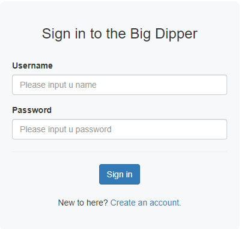
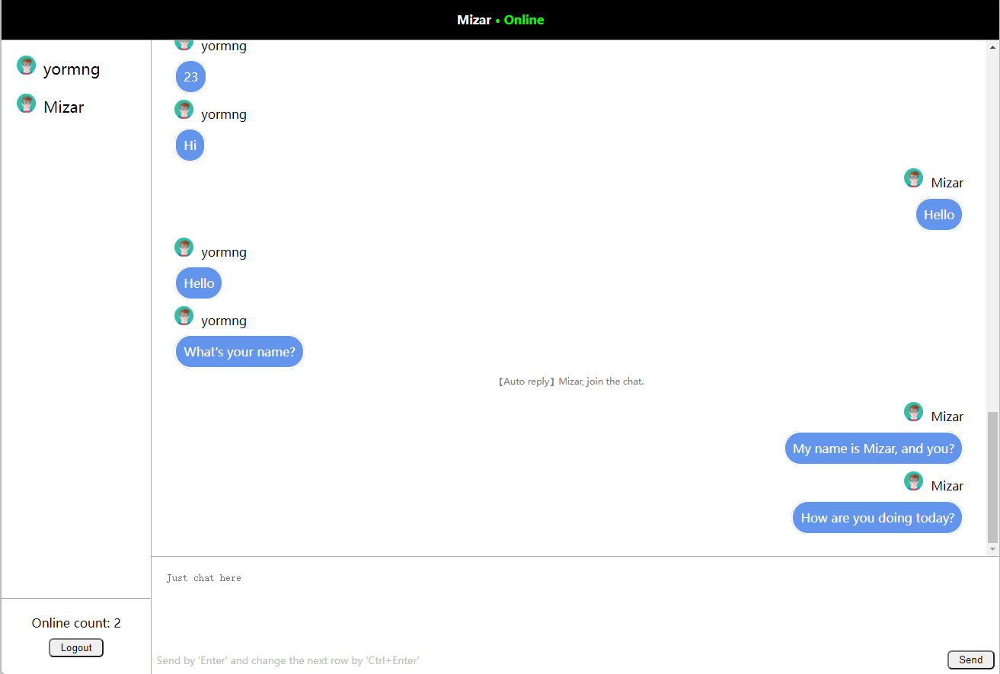

# Chatana

## Preview
login page:



index page:



## About interface
I am not a front-end programmer.

## Quick Start

`Chatana` is a chatting system powered by Django. I just provide you a raw version now.

`We still have a long way to go.`

You need to migrate the model files into your local database system:

```python
$ sudo cd chatana
$ sudo python manage.py makemigrations
$ sudo python manage.py migrate
```

At next time you can visit `Chatana` by `http://127.0.0.1:8000/chat/`. 

`Chatana` also provided you a register page and login page for redirecting, which are `/user/register/` and
`/user/login/`, while you are not in the login.


## What's the next
### I am trying my best to deploy `Chatana`.
Due to the difference between development and deployment, many complex actions should be taken in deployment 
environment. For example, websocket should be started with `dephne` etc. There's much work to learn and pay it into
production.

## Thanks

If you like `Chatana` or `Chatana` caters to your homework, please don't be stingy with your star.