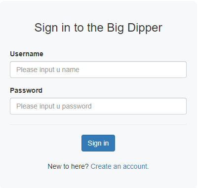
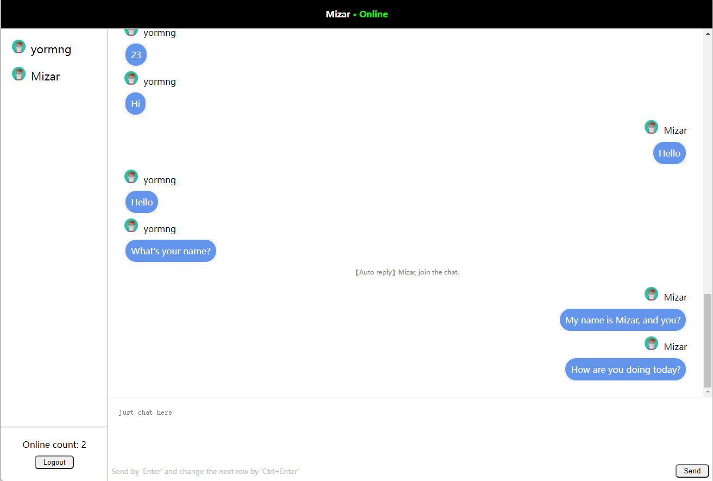

# Chatana

## Preview
login page:

index page:

## About interface
I am not a front-end programmer.

## Quick Start

Chatana is a chatting system powered by Django. I just provide you a raw version now.

`We still have a long way to go.`

## What's the next
### I am trying my best to deploy chatana.
Due to the difference between development and deployment, many complex actions should be taken in deployment 
environment. For example, websocket should be started with `dephne` etc. There's much work to learn and pay it into
production.

## Thanks

If you like chatana or chatana caters to your homework, please don't be stingy with your star.